# MemorEase 

MemorEase is an Android application developed with Kotlin, designed to help users preserve and share their memories — with the help of AI-generated questions. The app features a unique dual-user structure: individuals can save their memories, while relatives can contribute and view them with a dedicated interface. Firebase services and Hugging Face AI models are used for memory management and smart quiz generation.

  

MemorEase is a Kotlin-based Android application that empowers users to capture, preserve, and interact with their personal memories using text, voice, or images. The app supports two user types — individuals and their relatives — allowing a shared, collaborative experience centered around memory collection and reflection.

A standout feature is the AI-generated quiz system, which encourages cognitive engagement. Instead of relying on a general-purpose model, the app utilizes a custom fine-tuned FLAN-T5 model, trained specifically to generate relevant and meaningful questions based on user-submitted memories. This allows users to test their recollection, emotional connection, or details surrounding specific events — turning memory recall into an interactive and meaningful exercise.

To enhance motivation and engagement, a dynamic leaderboard is integrated into the app. Users earn points through memory uploads and quiz interactions, and rankings are visualized in a clean, competitive layout. Weekly performance reports are also generated in PDF format, providing users with insights into their memory activity over time.

MemorEase is built on Firebase for real-time database syncing, secure authentication, and cloud-based storage. Combined with its custom-trained Hugging Face model and responsive UI, the app provides a holistic experience that merges technology, memory, and emotional connection in a socially interactive platform.

---
###  Demo Video

##  Features

-  **User & Relative Login** – Separate flows with secure Firebase authentication
-  **Upload Memories** – Add text, voice, and image memories
-  **AI-Powered Questions** – Automatically generate quiz questions from memories using a Hugging Face model
-  **Weekly Reports** – Get visual performance feedback on memory sharing
-  **Leaderboard** – Track and compare memory sharing scores
-  **PDF Export** – Generate printable reports with memory statistics
-  **Modern UI** – Material Design + image assets for clean and interactive experience

---

##  Tech Stack

- **Language:** Kotlin
- **Architecture:** MVVM
- **UI:** XML layouts, RecyclerViews, Fragments
- **Backend:** Firebase Firestore, Firebase Auth, Cloudinary
- **AI Integration:** Hugging Face API (FLAN-T5 model)
- **Media Handling:** Glide for image loading, MediaPlayer for voice playback

---

##  Screenshots

###  User & Relative Login

  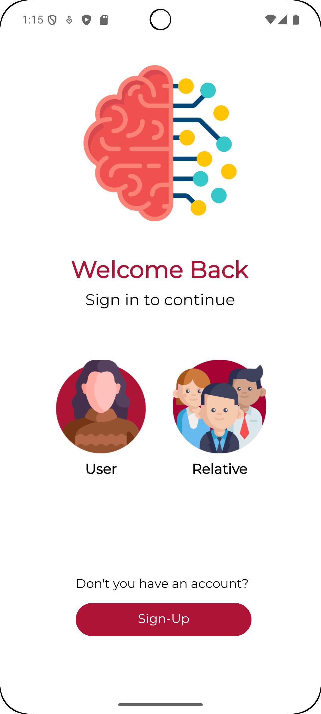
  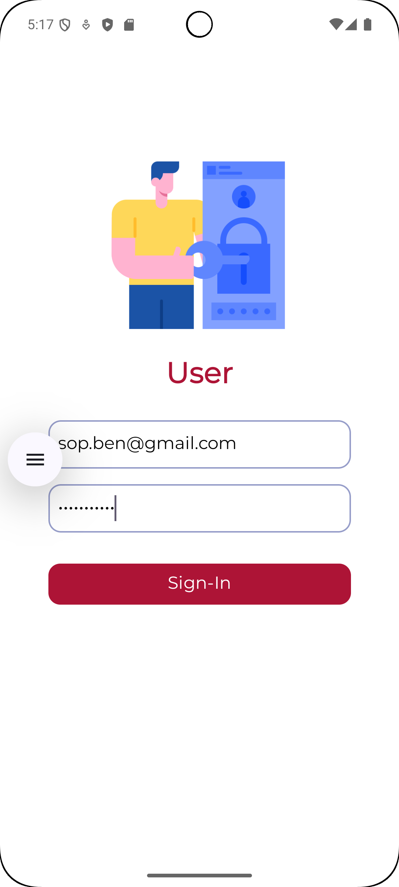
  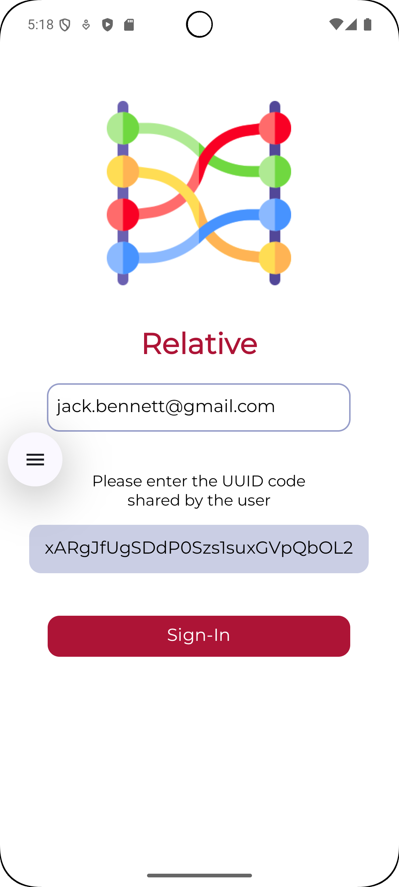

###  Home Screen / Upload & Review Memory

  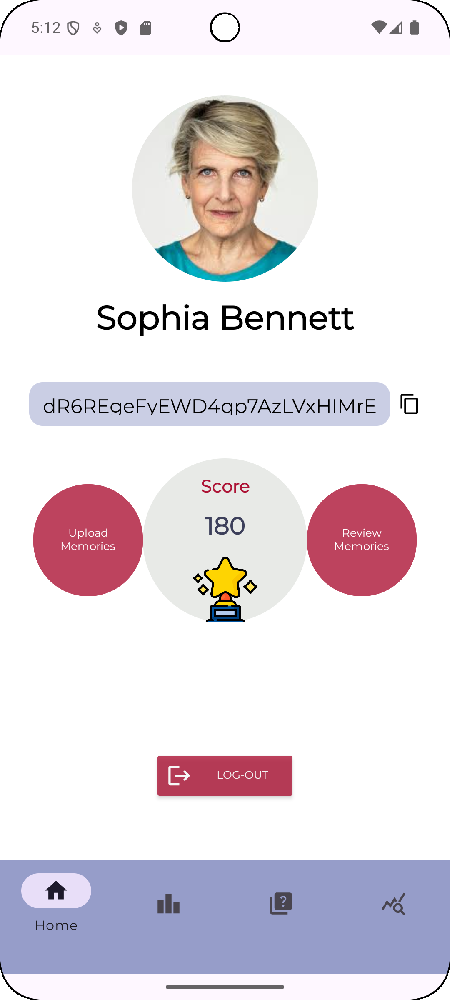
  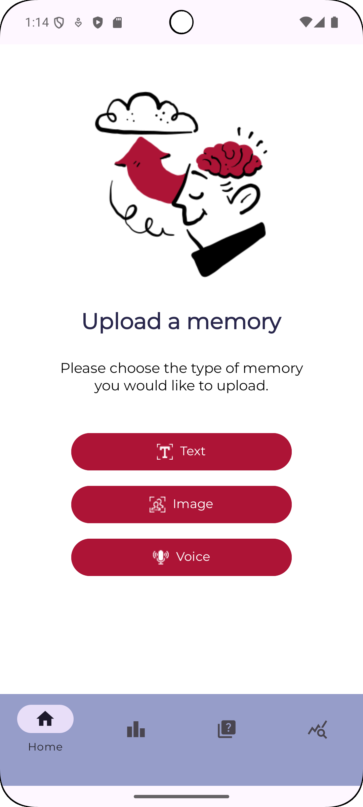
  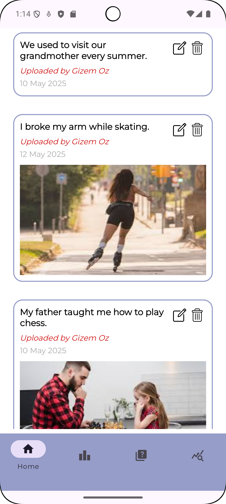

---

###  Generate Questions

  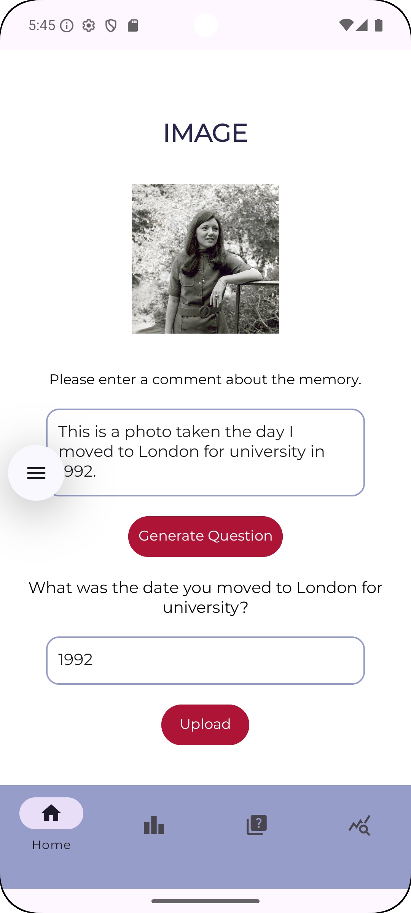
  
  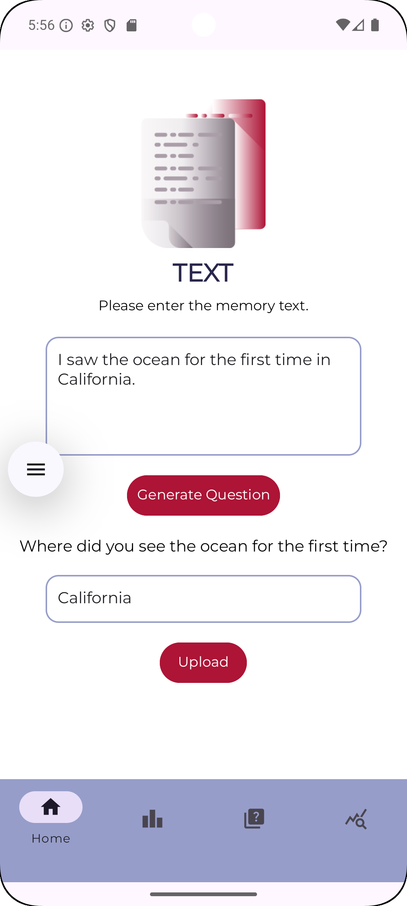
  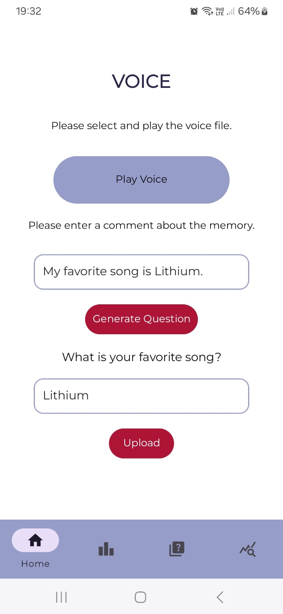
  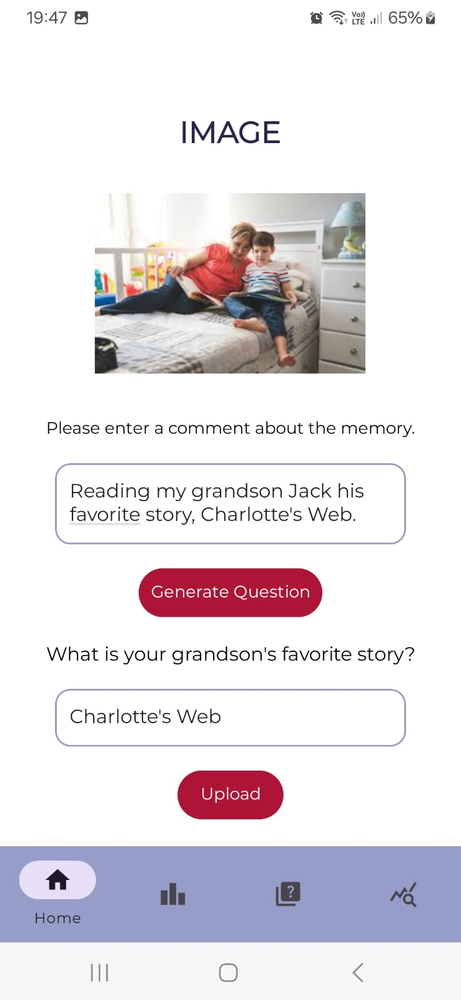
  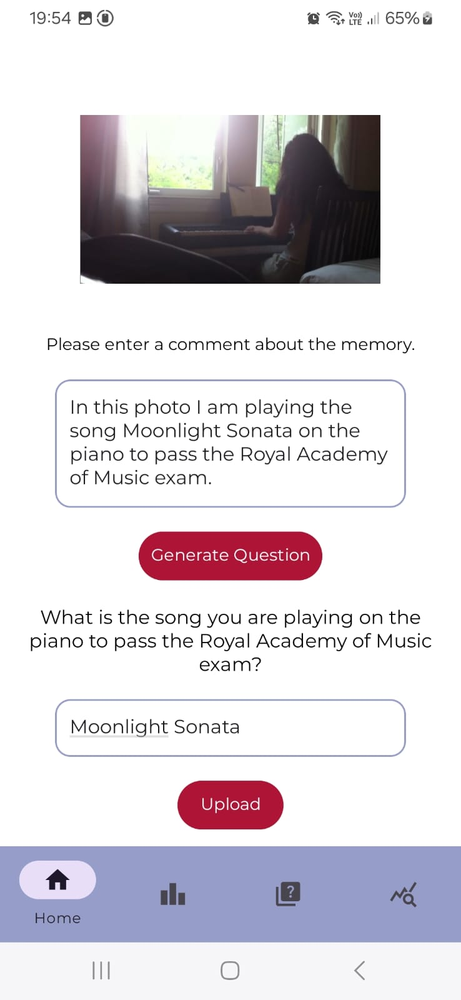

---

###  Quiz Screen

  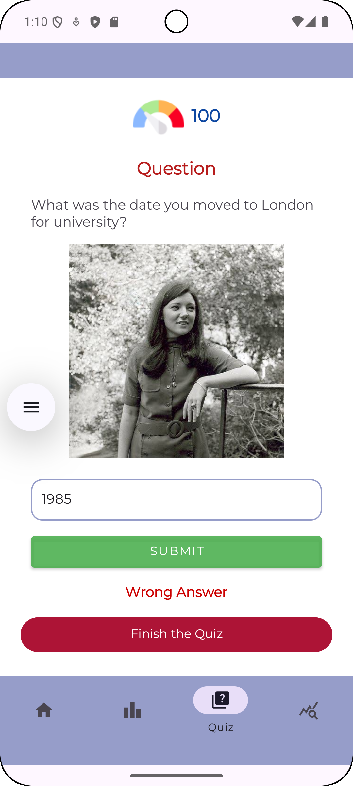
  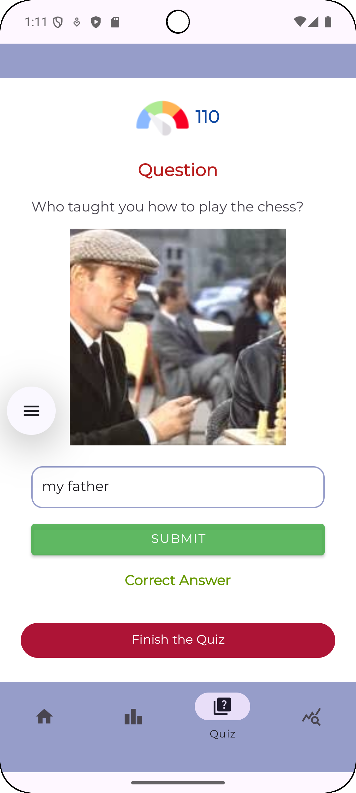
   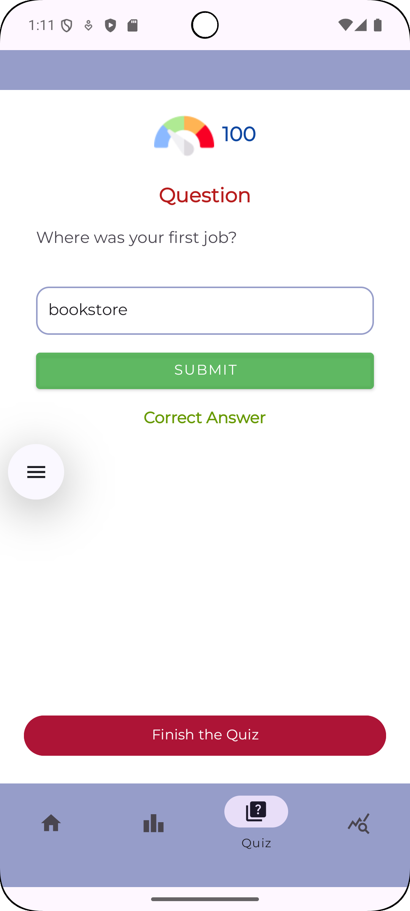
   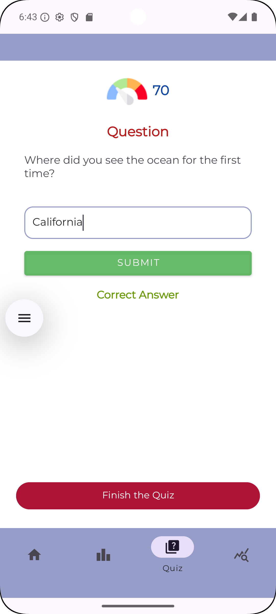
   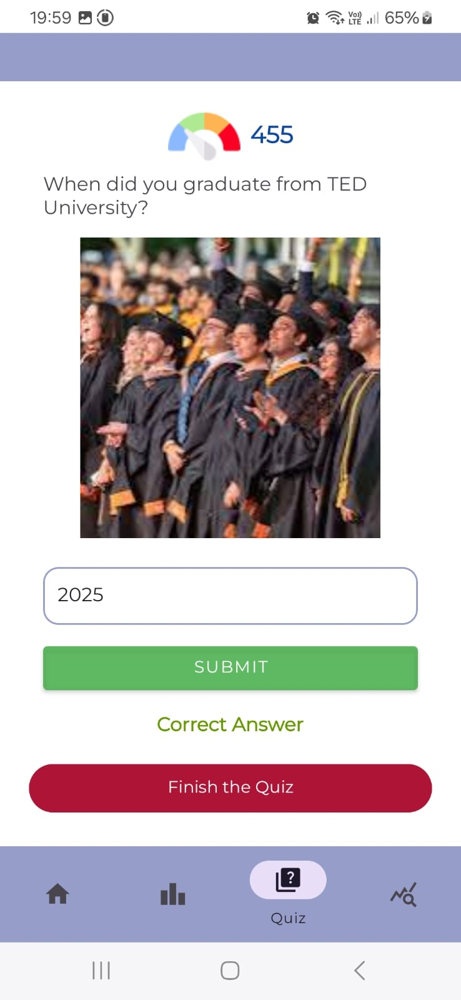
   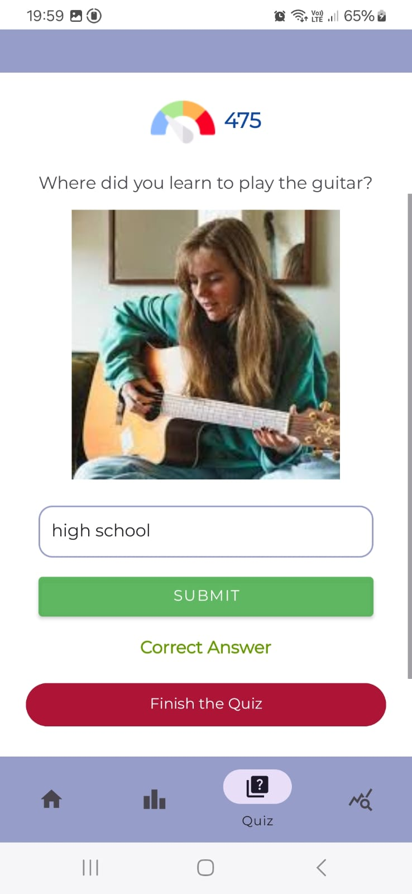

---

###  Leaderboard

  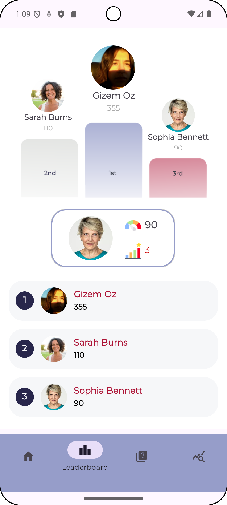

---

###  Weekly Report

  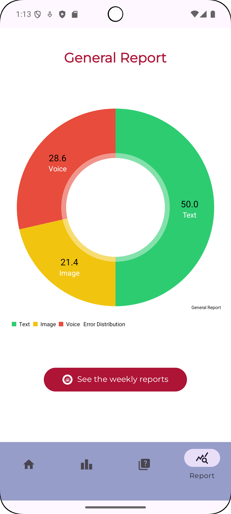
  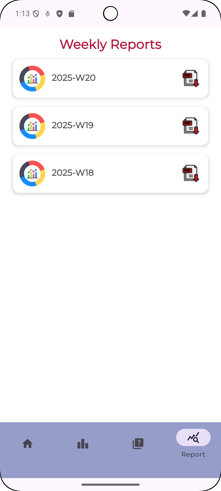
  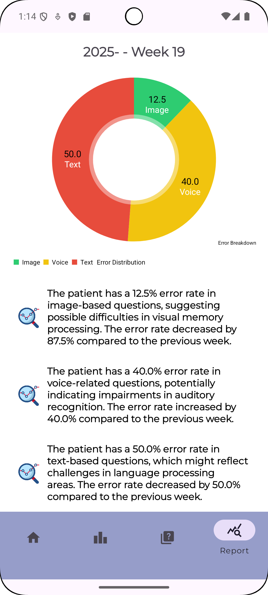

---

##  Developed By

**Gizem Öz**  
📧 ozgzm2001@gmail.com  
🌐 [linkedin.com/in/gizem-oz](https://linkedin.com/in/gizem-oz)

---

