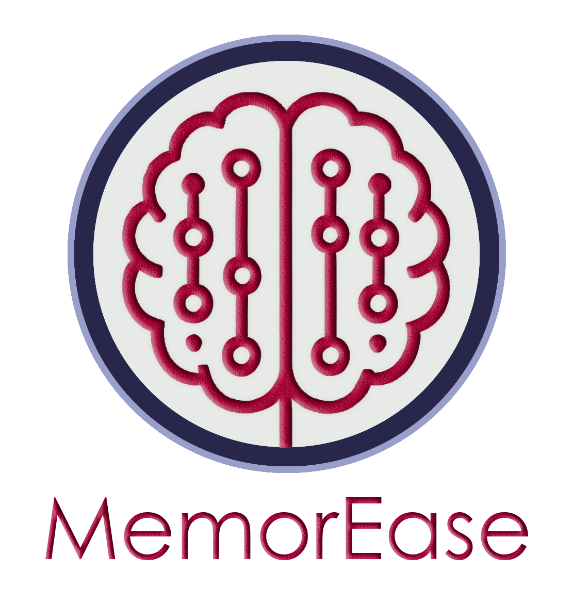

# MemorEase 

MemorEase is an Android application developed with Kotlin, designed to help users preserve and share their memories — with the help of AI-generated questions. The app features a unique dual-user structure: individuals can save their memories, while relatives can contribute and view them with a dedicated interface. Firebase services and Hugging Face AI models are used for memory management and smart quiz generation.



---

## 🎯 Features

- 🔐 **User & Relative Login** – Separate flows with secure Firebase authentication
- 📝 **Upload Memories** – Add text, voice, and image memories
- 🤖 **AI-Powered Questions** – Automatically generate quiz questions from memories using a Hugging Face model
- 📊 **Weekly Reports** – Get visual performance feedback on memory sharing
- 🏆 **Leaderboard** – Track and compare memory sharing scores
- 📄 **PDF Export** – Generate printable reports with memory statistics
- 🎨 **Modern UI** – Material Design + image assets for clean and interactive experience

---

## 🛠️ Tech Stack

- **Language:** Kotlin
- **Architecture:** MVVM
- **UI:** XML layouts, RecyclerViews, Fragments
- **Backend:** Firebase Firestore, Firebase Auth, Firebase Storage
- **AI Integration:** Hugging Face API (FLAN-T5 model)
- **PDF Creation:** Android `PdfDocument`
- **Media Handling:** Glide for image loading, MediaPlayer for voice playback

---

## 🔧 Setup Instructions

1. Clone the repo:
    ```bash
    git clone https://github.com/gzmoz/memorease-ai-quiz-app.git
    ```

2. Create a new Firebase project and download your own `google-services.json`  
   Place it in the `app/` directory.

3. Add your own Hugging Face token via secure API call (avoid hardcoding!).

4. Sync project and run on emulator or device.

> ⚠️ `google-services.json` is excluded from version control for security. You must configure Firebase yourself.

---

## 📸 Screenshots

| Upload Memory | Leaderboard | Weekly Report |
|---------------|-------------|---------------|
|  |  |  |

---

## 🎬 Demo Video

> 🧪 Coming soon: add screen recording or YouTube link here  
> `` or `[▶️ Watch on YouTube](https://youtu.be/...)`

---

## 👤 Developed By

**Gizem Öz**  
📧 ozgzm2001@gmail.com  
🌐 [linkedin.com/in/yourprofile](https://linkedin.com/in/yourprofile)

---

## 📜 License

This project is licensed under the MIT License.  
You are free to fork, build, or contribute — just don’t forget to give credit! 💙


